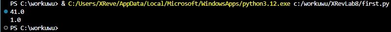

# Лабораторная работа №8
### Задание
    1. Решите обе задачи своего варианта.
    2. Примените декоратор к замыканию.
    3. Оформите отчёт в README.md. Отчёт должен содержать:
          Условия задач
          Описание проделанной работы
          Скриншоты результатов
          Ссылки на используемые материалы

    Вариант 8:
        Замыкание для поиска среднего в аргументах.
        Декоратор для проверки аргументов функции на тип и диапазон значений.

### Описание проделанной работы
Написал программы по варианту 8
Оформил отчёт в файле readme.md

#### Инструкция по запуску
1. Открыть папку XRevLab8 с помощью VSCodium
2. Вызвать консоль и прописать `gcc first/second.py -o result` 
3. прописать в консоли `./result` 

### Вывод программы
## first

## second

### Ссылки
1. https://evil-teacher.on.fleek.co/prog_pm/term1/lab03/
